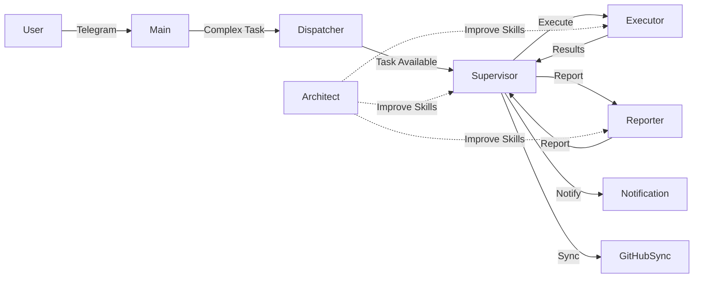

# Agent Specifications

**Detailed documentation for each agent in the OpenClaw system**

---

## Agent Overview

| Agent | ID | Workspace | Primary Function |
|-------|----|-----------|--------------------|
| Main | `main` | workspace | User interaction & routing |
| Dispatcher | `dispatcher` | workspace-dispatcher | Task queue polling |
| Supervisor | `supervisour` | workspace-supervisour | Orchestration & delegation |
| Executor | `executor` | workspace-executor | Task execution (browser) |
| Reporter | `reporter` | workspace-reporter | Documentation & reports |
| Notification | `notification` | workspace-notification | Alerts (Email/Telegram) |
| GitHubSync | `githubsync` | workspace-githubsync | Repository syncing |
| Architect | `architect` | workspace-architect | Skill file management |

---

## 🤝 Main Agent

**Identity**: Conversational interface, general assistant

### Purpose

Direct user interaction for:
- General questions
- Task submission
- Status checks
- Conversational AI

### Capabilities

- Natural language understanding
- Context management
- Routing complex tasks to Dispatcher/Supervisor
- Memory management (MEMORY.md)

### Configuration

```json
{
  "id": "main",
  "workspace": "/home/ibr-ai-agent/.openclaw/workspace"
}
```

### Typical Workflows

**User asks question:**
1. Parse user intent
2. If simple → answer directly
3. If complex → route to Supervisor
4. Update MEMORY.md with significant events

**User submits task:**
1. Create task in Supabase
2. Set status = 'pending'
3. Notify user task is queued
4. Dispatcher will pick it up in next poll

---

## 🔄 Dispatcher Agent

**Identity**: Task Router
**Emoji**: 🔄 (not in IDENTITY.md, but conceptual)

### Purpose

Poll Supabase task queue and notify Supervisor of pending work.

### Responsibilities

1. **Poll database** every 60 seconds
2. **Fetch pending tasks** ordered by priority
3. **Notify Supervisor** via queue file
4. **Log activity** to daily memory

### Architecture

```
┌─────────────┐     ┌──────────────┐     ┌──────────────┐
│  Supabase   │────▶│  Dispatcher  │────▶│  Supervisor  │
│ (polling)   │     │   (router)   │     │   (queue)    │
└─────────────┘     └──────────────┘     └──────────────┘
```

### Configuration

```json
{
  "id": "dispatcher",
  "workspace": "/home/ibr-ai-agent/.openclaw/workspace-dispatcher",
  "agentDir": "/home/ibr-ai-agent/.openclaw/agents/dispatcher/agent"
}
```

### Key Files

- `tasks/dispatcher.js` - Main polling orchestrator
- `tasks/supabase-client.js` - Database connection
- `tasks/fetch-pending-tasks.js` - Task query logic
- `tasks/notify-supervisor.js` - Queue notification
- `tasks/memory-logger.js` - Activity logging

### Polling Cycle

Every 60 seconds:

1. Test Supabase connection
2. Query: `SELECT * FROM tasks WHERE status = 'pending' ORDER BY priority DESC, created_at ASC`
3. If 0 tasks → Log `POLL_NO_TASKS`, sleep
4. If N tasks → Format notification, write to Supervisor queue, log success

### Queue Format

**File**: `agents/supervisour/sessions/pending_queue.jsonl`

```json
{
  "type": "tasks_available",
  "timestamp": "2026-02-11T14:30:00Z",
  "task_count": 3,
  "from_agent": "dispatcher",
  "tasks": [...]
}
```

### Error Handling

- **Connection errors** - Log, continue next cycle
- **Supervisor unreachable** - Log, task stays pending
- **Unexpected errors** - Full error log, retry next cycle

---

## 🧠 Supervisor Agent

**Identity**: Task Orchestrator
**Emoji**: 🧠
**Name**: Supervisor

### Purpose

Receive tasks from Dispatcher, analyze requirements, create execution plans, and coordinate specialized agents (Executor, Reporter, Notification).

### Capabilities

- **Strategic planning** - Break complex tasks into subtasks
- **Resource allocation** - Assign work to appropriate agents
- **Progress monitoring** - Track execution status
- **Error recovery** - Handle failures, retry logic
- **User communication** - Status updates via Notification agent

### Skills

**Location**: `workspace-supervisour/supervisour-skill/SKILL.md`

Defines:
- Task delegation workflows
- Sub-agent management
- Priority handling
- Escalation procedures

### Typical Workflow

#### Task Execution

1. **Receive notification** from Dispatcher
2. **Read task details** from Supabase
3. **Analyze requirements**
   - What data is needed?
   - Which agents can help?
   - What's the execution order?
4. **Create execution plan**
   - Step 1: Executor scrapes data
   - Step 2: Executor processes results
   - Step 3: Reporter generates summary
   - Step 4: Notification sends to user
5. **Update task status** to 'in_progress'
6. **Delegate to agents** sequentially or parallel
7. **Monitor progress** and handle errors
8. **Finalize task**
   - Update status to 'completed' or 'failed'
   - Ensure reports are created
9. **Notify user** of completion

### Agent Invocation

```javascript
// Supervisor calling Executor
const result = await callAgent('executor', {
  action: 'navigate_and_extract',
  url: 'https://example.com',
  selectors: {
    title: '.product-title',
    price: '.price'
  },
  timeout: 300
});

// Supervisor calling Reporter
await callAgent('reporter', {
  action: 'generate_task_report',
  task_id: taskId,
  data: result 
});
```

### Configuration

```json
{
  "id": "supervisour",
  "workspace": "/home/ibr-ai-agent/.openclaw/workspace-supervisour",
  "agentDir": "/home/ibr-ai-agent/.openclaw/agents/supervisour/agent",
  "subagents": {
    "allowAgents": ["*"]
  }
}
```

### Error Handling

- **Agent timeout** - Retry once, then fail gracefully
- **Partial failure** - Continue with available data
- **Complete failure** - Update task status, create error report, notify user

---

## ⚡ Executor Agent

**Identity**: Action Specialist
**Emoji**: ⚡
**Name**: Executor

### Purpose

Execute tasks requiring browser automation, web scraping, form filling, and web interactions.

### Capabilities

- **Browser automation** - Navigate, click, type, scroll
- **Data extraction** - Scrape structured/unstructured data
- **Form submission** - Fill forms, handle authentication
- **Screenshot capture** - Visual verification
- **JavaScript execution** - Custom scripts in browser context

### Skills

**Location**: `workspace-executor/browser/SKILL.md`

Currently minimal, can be enhanced by Architect agent to include:
- Navigation workflows
- Data extraction patterns
- Error handling strategies
- Constraint definitions

### Typical Workflow

#### Web Scraping Task

1. **Receive task** from Supervisor
2. **Launch browser** (profile: openclaw)
3. **Navigate to URL**
4. **Wait for page load**
5. **Extract data** using selectors
6. **Structure results** as JSON/CSV
7. **Take verification screenshot**
8. **Close browser**
9. **Return results** to Supervisor

### Browser Integration

**Configuration**:
```json
{
  "browser": {
    "enabled": true,
    "executablePath": "/usr/bin/google-chrome",
    "defaultProfile": "openclaw",
    "profiles": {
      "openclaw": {
        "cdpPort": 18800,
        "driver": "openclaw"
      }
    }
  }
}
```

**Connection**:
```javascript
const browser = await puppeteer.connect({
  browserURL: 'http://localhost:18800'
});
```

### Error Handling

- **Page timeout** - Retry once (max 30s each)
- **Element not found** - Report specific error
- **Authentication required** - Request credentials from Supervisor
- **Network error** - Log, retry, fail gracefully

### Configuration

```json
{
  "id": "executor",
  "workspace": "/home/ibr-ai-agent/.openclaw/workspace-executor",
  "agentDir": "/home/ibr-ai-agent/.openclaw/agents/executor/agent"
}
```

---

## 📊 Reporter Agent

**Identity**: Documentation Specialist
**Emoji**: 📊
**Name**: Reporter

### Purpose

Generate reports, analyze task execution, create summaries, and document outcomes.

### Capabilities

- **Daily reports** - Summary of day's activity
- **Weekly reports** - Aggregated metrics and trends
- **Task reports** - Individual task documentation
- **Data analysis** - Metrics from Supabase
- **Custom reports** - User-defined formats

### Skills

**Locations**:
- `workspace-reporter/daily-report/SKILL.md`
- `workspace-reporter/weekly-report/SKILL.md`
- `workspace-reporter/task-report/SKILL.md`

### Typical Workflows

#### Daily Report Generation

1. **Receive request** from Supervisor or schedule
2. **Query Supabase** for today's tasks
3. **Aggregate metrics**:
   - Total tasks: 15
   - Completed: 12
   - Failed: 2
   - Pending: 1
4. **Generate markdown report**
5. **Store in database** (`reports` table)
6. **Return to requester**

#### Task Report Generation

1. **Fetch task details** from database
2. **Fetch related reports** for this task
3. **Compile execution timeline**
4. **Summarize outcomes**
5. **Create structured report**

### Report Format

```markdown
# Task Report: [Task Title]

**Task ID**: abc-123
**Status**: Completed
**Duration**: 5m 32s

## Summary
Successfully extracted pricing data from 5 competitor websites.

## Details
- Pages visited: 5
- Data rows extracted: 47
- Errors encountered: 0

## Timeline
- 14:30:15 - Task started
- 14:30:45 - First page scraped
- 14:35:47 - Task completed

## Results
[Data summary or link to full results]
```

### Configuration

```json
{
  "id": "reporter",
  "workspace": "/home/ibr-ai-agent/.openclaw/workspace-reporter",
  "agentDir": "/home/ibr-ai-agent/.openclaw/agents/reporter/agent"
}
```

---

## 📧 Notification Agent

**Identity**: Alert Manager
**Emoji**: 📧 (conceptual)
**Name**: Notification

### Purpose

Send notifications via email, Telegram, or other channels.

### Capabilities

- **Email sending** - SMTP integration
- **Telegram messages** - Bot API
- **Alert formatting** - Rich text, markdown
- **Delivery tracking** - Confirmation logs

### Skills

**Locations**:
- `workspace-notification/email/SKILL.md`
- `workspace-notification/telegram/SKILL.md`

### Telegram Integration

**Configuration**:
```json
{
  "channels": {
    "telegram": {
      "enabled": true,
      "botToken": "8405762156:AAF...",
      "groupPolicy": "allowlist",
      "streamMode": "partial"
    }
  }
}
```

### Typical Workflow

#### Send Task Completion Notification

1. **Receive request** from Supervisor
2. **Format message**:
   ```
   ✅ Task Completed
   Title: Extract pricing data
   Duration: 5m 32s
   Status: Success
   ```
3. **Send via Telegram** to user
4. **Log delivery** in memory

### Error Handling

- **SMTP timeout** - Retry with 30s backoff
- **Telegram API error** - Log, retry once
- **Authentication failure** - Report to Supervisor

### Configuration

```json
{
  "id": "notification",
  "workspace": "/home/ibr-ai-agent/.openclaw/workspace-notification",
  "agentDir": "/home/ibr-ai-agent/.openclaw/agents/notification/agent"
}
```

---

## 🔗 GitHubSync Agent

**Identity**: Repository Synchronizer
**Emoji**: 🔗 (conceptual)
**Name**: GitHubSync

### Purpose

Synchronize data with GitHub repositories, manage commits, pull/push operations.

### Capabilities

- **Repository cloning**
- **Commit creation**
- **Push/pull operations**
- **Branch management**

### Skills

**Location**: `workspace-githubsync/githubsync/SKILL.md`

### Configuration

```json
{
  "id": "githubsync",
  "workspace": "/home/ibr-ai-agent/.openclaw/workspace-githubsync",
  "agentDir": "/home/ibr-ai-agent/.openclaw/agents/githubsync/agent"
}
```

---

## 🏗️ Architect Agent

**Identity**: Skill File Manager
**Emoji**: 🏗️
**Name**: Blueprint

### Purpose

Create and maintain SKILL.md files across all agents. Improve agent behavior by enhancing skill definitions WITHOUT touching system files or code.

### Capabilities

- **Skill discovery** - Find all SKILL.md files
- **Targeted editing** - Surgical improvements
- **YAML validation** - Ensure syntax correctness
- **Change documentation** - Log all modifications
- **Rollback support** - Backup before editing

### Safety Boundaries

**✅ Can Edit**:
- Any `SKILL.md` file in skill folders
- Own `memory/` files
- Own `TOOLS.md`

**❌ Cannot Edit**:
- System files: `AGENTS.md`, `SOUL.md`, `IDENTITY.md`, `USER.md`
- Code files: `.js`, `.sh`, `.json`
- Other agents' memory or configs

### Typical Workflow

#### Enhance Browser Skill

1. **Receive request**: "Add constraint to avoid /r/problemsInSoftware"
2. **Read current skill**: `workspace-executor/browser/SKILL.md`
3. **Analyze impact**: Won't conflict with existing workflows
4. **Make edit**: Add Constraints section
5. **Verify**: Check YAML syntax, instruction clarity
6. **Document**: Log in `memory/2026-02-11.md`
7. **Report**: Summarize changes

### Configuration

```json
{
  "id": "architect",
  "workspace": "/home/ibr-ai-agent/.openclaw/workspace-architect",
  "agentDir": "/home/ibr-ai-agent/.openclaw/agents/architect/agent"
}
```

### Detailed Documentation

See:
- [`workspace-architect/IDENTITY.md`](file:///home/ibr-ai-agent/.openclaw/workspace-architect/IDENTITY.md)
- [`workspace-architect/SOUL.md`](file:///home/ibr-ai-agent/.openclaw/workspace-architect/SOUL.md)
- [`workspace-architect/AGENTS.md`](file:///home/ibr-ai-agent/.openclaw/workspace-architect/AGENTS.md)

---

## Agent Communication Summary



---

**Each agent is specialized. Together, they orchestrate complex workflows.**
