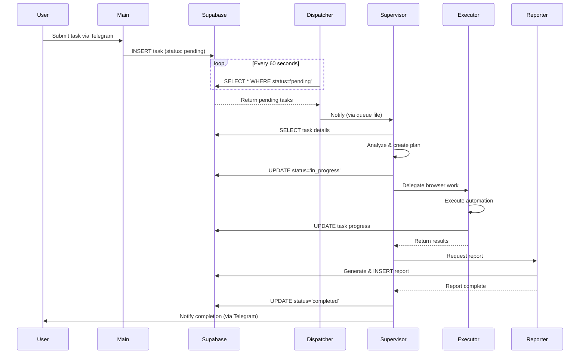

# OpenClaw Architecture

**Deep dive into the multi-agent orchestration system**

---

## System Overview

OpenClaw implements a **distributed agent architecture** where specialized AI agents collaborate to execute complex tasks. The system is built on three core principles:

1. **Agent Specialization** - Each agent is an expert in their domain
2. **Skill-Based Behavior** - Agent capabilities defined in SKILL.md files
3. **Intelligent Orchestration** - Supervisor coordinates agent collaboration

---

## Architectural Layers

### 1. **Interface Layer**

User interaction points:

- **Telegram Bot** - Primary interface for users
- **HTTP Gateway** - REST API (port 18789, local mode)
- **CLI** - Direct terminal commands
- **Browser Extension** - Optional Chrome extension integration

### 2. **Orchestration Layer**

Task management and coordination:

- **Dispatcher Agent** - Polls Supabase for pending tasks (60s interval)
- **Supervisor Agent** - Analyzes tasks, creates execution plans, delegates work
- **Main Agent** - Conversational AI for direct user interaction

### 3. **Execution Layer**

Specialized task execution:

- **Executor Agent** - Browser automation, web scraping, form filling
- **Reporter Agent** - Report generation, metric analysis, documentation
- **Notification Agent** - Email, Telegram, webhook notifications
- **GitHubSync Agent** - Repository synchronization

### 4. **Meta Layer**

System maintenance and improvement:

- **Architect Agent** - Manages SKILL.md files across all agents

### 5. **Data Layer**

Persistent storage via Supabase PostgreSQL:

```sql
-- Tasks table: Work queue
CREATE TABLE tasks (
    id UUID PRIMARY KEY,
    title VARCHAR(500),
    description TEXT,
    status VARCHAR(50), -- 'pending', 'in_progress', 'completed', 'failed'
    priority INTEGER,
    executor_name VARCHAR(255),
    metadata JSONB,
    created_at TIMESTAMP,
    updated_at TIMESTAMP,
    started_at TIMESTAMP,
    completed_at TIMESTAMP
);

-- Reports table: Execution results
CREATE TABLE reports (
    id UUID PRIMARY KEY,
    task_id UUID REFERENCES tasks(id),
    executor_name VARCHAR(255),
    content TEXT,
    report_type VARCHAR(100),
    metadata JSONB,
    created_at TIMESTAMP
);
```

---

## Agent Communication Model

### 1. **Inter-Agent Communication**

Agents communicate via the `agent_to_agent` tool:

```javascript
// Supervisor → Executor
const result = await callAgent('executor', {
  action: 'scrape_website',
  url: 'https://example.com',
  selector: '.pricing-table'
});

// Supervisor → Reporter
await callAgent('reporter', {
  action: 'generate_report',
  task_id: 'uuid-here',
  report_type: 'weekly'
});
```

**Configuration** (`openclaw.json`):
```json
{
  "tools": {
    "agentToAgent": {
      "enabled": true,
      "allow": ["main", "supervisour", "dispatcher", ...]
    }
  }
}
```

### 2. **Task Queue Communication**

Dispatcher → Supervisor via file-based queue:

**Queue File**: `agents/supervisour/sessions/pending_queue.jsonl`

**Format**:
```json
{
  "type": "tasks_available",
  "timestamp": "2026-02-11T10:30:00Z",
  "task_count": 3,
  "from_agent": "dispatcher",
  "tasks": [
    {
      "id": "uuid",
      "title": "Task title",
      "description": "Full task description",
      "priority": 8,
      "created_at": "2026-02-11T10:20:00Z"
    }
  ]
}
```

### 3. **Database Communication**

All agents can read/write to Supabase:

```javascript
// Update task status
await supabase
  .from('tasks')
  .update({ status: 'in_progress', started_at: new Date() })
  .eq('id', taskId);

// Create report
await supabase
  .from('reports')
  .insert({
    task_id: taskId,
    executor_name: 'executor',
    content: reportContent,
    report_type: 'success'
  });
```

---

## Task Lifecycle



### Status Transitions

```
pending → in_progress → completed
                     ↘ failed
```

**Status Meanings**:
- `pending` - Waiting for dispatcher to discover
- `in_progress` - Assigned to executor, work happening
- `completed` - Successfully finished
- `failed` - Execution failed, report contains error details

---

## Skill System Architecture

### Skill Definition

Each agent capability is defined in a `SKILL.md` file:

**Location**: `workspace-<agent>/<skill-name>/SKILL.md`

**Structure**:
```markdown
---
name: skill-name
description: Brief capability description
---

## Purpose
What this skill enables

## Workflows
Step-by-step processes

## Constraints
Rules and boundaries

## Error Handling
Graceful degradation strategies
```

### Skill Management

The **Architect Agent** manages all skills:

1. **Discovery** - Finds all SKILL.md files across workspaces
2. **Editing** - Makes targeted improvements (never wholesale replacements)
3. **Verification** - Validates YAML syntax and instruction clarity
4. **Documentation** - Logs all changes in memory

**Safety Boundaries**:
- ✅ Can edit: SKILL.md files only
- ❌ Cannot edit: AGENTS.md, SOUL.md, code files, system configs

### Skill Loading

Agents read skills on-demand:

```javascript
// Agent reads its skill at runtime
const skillContent = fs.readFileSync('browser/SKILL.md', 'utf8');
const { frontmatter, content } = parseSkill(skillContent);

// Use skill instructions to guide behavior
if (frontmatter.name === 'browser') {
  followWorkflow(content.workflows['Data Extraction']);
}
```

---

## Memory & Continuity

### Memory Types

#### 1. **Daily Memory** (`memory/YYYY-MM-DD.md`)

Raw activity logs, created automatically:

```markdown
# Memory Log - 2026-02-11

## Task Execution: Extract pricing data

**[14:30:15]** TASK_START
- Task ID: abc-123
- Title: Extract pricing from competitor sites

**[14:30:45]** BROWSER_NAVIGATION
- URL: https://competitor.com/pricing
- Status: Success

**[14:31:20]** DATA_EXTRACTED
- Rows: 15
- Format: JSON

**[14:31:30]** TASK_COMPLETE
```

#### 2. **Long-Term Memory** (`MEMORY.md`)

Curated learnings (main agent only):

```markdown
# Long-Term Memory

## Lessons Learned

### Reddit Lead Generation (2026-02-10)
Discovered that /r/problemsInSoftware should be excluded from scraping.
Added constraint to browser skill.

### Email Notifications (2026-02-05)
SMTP timeouts require 30s retry with exponential backoff.
Updated notification skill error handling.
```

#### 3. **Session Memory**

Recent conversation history (managed by OpenClaw runtime):
- Last N messages
- Context window management
- Automatic summarization when approaching limits

### Memory Access Pattern

Each agent session:

1. **Read yesterday's memory** - Understand recent activity
2. **Read today's memory** - Check what's been done today
3. **Read MEMORY.md** - Access curated knowledge (main agent)
4. **Perform work**
5. **Write to today's memory** - Log activity

---

## Browser Architecture

### Browser Profiles

OpenClaw supports multiple browser profiles:

```json
{
  "browser": {
    "enabled": true,
    "executablePath": "/usr/bin/google-chrome",
    "defaultProfile": "openclaw",
    "profiles": {
      "openclaw": {
        "cdpPort": 18800,
        "driver": "openclaw",
        "color": "#0088FF"
      },
      "my-chrome": {
        "cdpUrl": "http://127.0.0.1:18792",
        "driver": "extension",
        "color": "#00AA00"
      }
    }
  }
}
```

### Browser Drivers

1. **OpenClaw Driver** - Launches Chrome with CDP
2. **Extension Driver** - Connects to existing Chrome via extension

### Executor ↔ Browser Flow

```javascript
// Executor receives browser task
async function executeBrowserTask(task) {
  // 1. Launch/connect to browser
  const browser = await connectBrowser('openclaw');
  
  // 2. Create page
  const page = await browser.newPage();
  
  // 3. Navigate
  await page.goto(task.url);
  
  // 4. Execute workflow from SKILL.md
  const data = await extractData(page, task.selectors);
  
  // 5. Close
  await browser.close();
  
  // 6. Return results
  return { success: true, data };
}
```

---

## Configuration Management

### Primary Config: `openclaw.json`

Defines all system settings:

```json
{
  "meta": { "lastTouchedVersion": "2026.2.1" },
  "browser": { ... },
  "auth": { ... },
  "models": { ... },
  "agents": {
    "defaults": { ... },
    "list": [
      { "id": "main" },
      { "id": "supervisour", "workspace": "..." },
      ...
    ]
  },
  "tools": { ... },
  "channels": { ... }
}
```

### Environment Variables: `.env`

Secrets and credentials:

```bash
SUPABASE_URL=https://xxx.supabase.co
SUPABASE_ANON_KEY=eyJhbGc...
TELEGRAM_BOT_TOKEN=8405762156:AAF...
```

### Agent Configs: Workspace Files

Each agent's workspace contains:
- `IDENTITY.md` - Who they are
- `SOUL.md` - How they think
- `AGENTS.md` - What they do
- `TOOLS.md` - Environment specifics

---

## Scalability Considerations

### Current Design

- **Single machine** - All agents run on one server
- **File-based queues** - Dispatcher → Supervisor via JSONL files
- **Supabase backend** - Handles multiple concurrent clients

### Scaling Strategies

#### Horizontal Scaling

1. **Multiple Executors** - Run executor agents on different machines
2. **Task sharding** - Partition tasks by priority/type
3. **Load balancer** - Distribute supervisor requests

#### Vertical Scaling

1. **Increase resources** - More CPU/RAM for browser automation
2. **Optimize skills** - Reduce redundant operations
3. **Cache frequently accessed data**

#### Database Scaling

1. **Connection pooling** - Supabase handles this automatically
2. **Read replicas** - For report generation
3. **Task archival** - Move old tasks to archive table

---

## Error Handling & Resilience

### Error Propagation

```
Executor encounters error
      ↓
Logs to memory/YYYY-MM-DD.md
      ↓
Returns error to Supervisor
      ↓
Supervisor decides: retry / fail / alternate approach
      ↓
Updates task status to 'failed' if unrecoverable
      ↓
Notifies user via Notification agent
```

### Graceful Degradation

Agents follow "fail gracefully" principles:

1. **Connection errors** - Retry with exponential backoff
2. **Missing data** - Continue with partial results
3. **Timeout** - Return what was completed
4. **Agent unavailable** - Queue task for later

### Monitoring

- **Memory logs** - Daily activity per agent
- **Database** - Task status transitions
- **Reports** - Success/failure metrics

---

## Security Model

### Authentication

- **Supabase** - Row-level security (RLS) policies
- **Telegram** - Bot token authentication
- **Gateway** - Token-based auth for HTTP API

### Authorization

- **Agent permissions** - Configure which agents can call others
- **Skill boundaries** - Architect cannot edit system files
- **Browser sandbox** - Isolated execution environment

### Data Privacy

- **Local-first** - All processing on your infrastructure
- **Encrypted transit** - HTTPS for Supabase, Telegram
- **Credential management** - .env file (gitignored)

---

## Performance Characteristics

### Typical Latencies

- **Dispatcher poll** - 60s interval
- **Agent invocation** - 100-500ms
- **Browser automation** - 2-30s (varies by task)
- **Report generation** - 500ms-5s

### Resource Usage

- **Memory** - 500MB-2GB (depends on browser usage)
- **CPU** - Low idle, spikes during browser automation
- **Network** - Moderate (Supabase queries, LLM API calls)
- **Disk** - Low (memory logs, minimal write patterns)

---

## Future Architecture Considerations

### Potential Enhancements

1. **Real-time queue** - Replace 60s polling with push notifications
2. **Distributed agents** - Agents on different machines
3. **Plugin system** - Third-party skill extensions
4. **Web dashboard** - Visual task monitoring
5. **Workflow designer** - GUI for creating workflows
6. **Multi-tenant** - Support multiple users/teams

---

**This architecture enables flexible, maintainable, and scalable multi-agent orchestration.**
